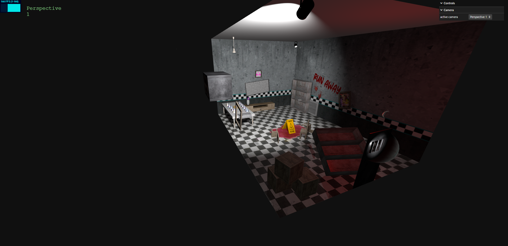

# SGI 2023/2024 - TP1
## Group T03G02
| Name             | Number    | E-Mail             |
| ---------------- | --------- | ------------------ |
| Gustavo Costa         | 202004187 | up202004187@edu.fe.up.pt                |
| João Oliveira         | 202004407 | up202004407@edu.fe.up.pt               |
----
## Project information
We've just wrapped up a ThreeJS scene inspired by the FNAF Party Room. Going beyond the basics, we injected creativity into every detail. Our focus was on elevating the experience with imaginative elements, surpassing the minimum requirements.

Mandatory Objects:
- Floor & Walls
- Table
- Plate, Cake & Candle
- Window
- Beetle Car
- Spiral Spring
- Newspaper
- Jar & Flower

Additional Objects:
- Table Cover
- Wet Floor Caution Sign
- Chairs
- Blood
- Shelves & Furniture
- Crates
- Door
- Television
- Party Hats
- Vent
- Spotlight & Lamp

 <a href="127.0.0.1:5500">Link to the scene</a>