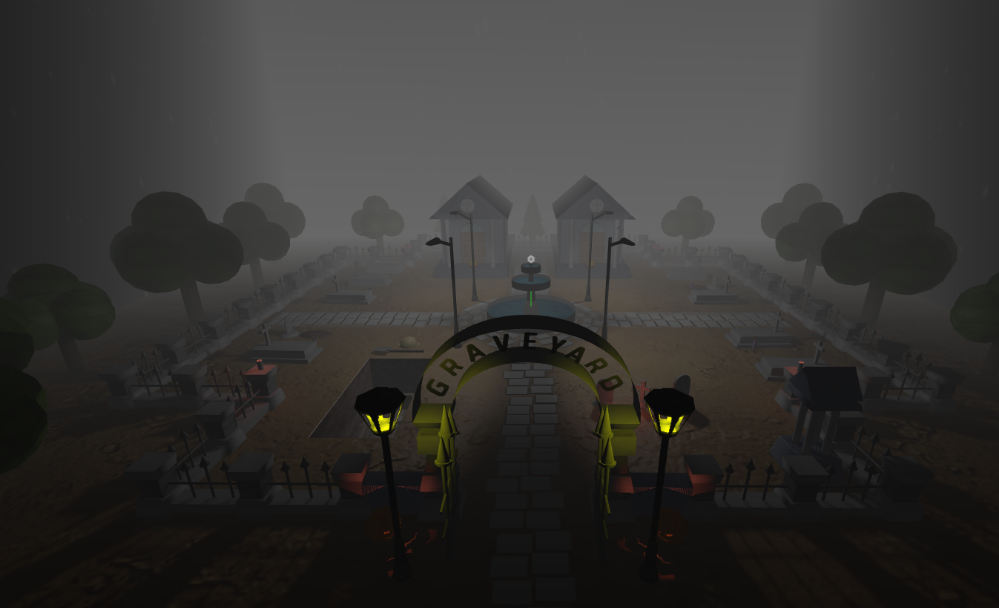

# SGI 2023/2024 - TP2
## Group T03G02
| Name             | Number    | E-Mail             |
| ---------------- | --------- | ------------------ |
| Gustavo Costa         | 202004187 | up202004187@edu.fe.up.pt                |
| João Oliveira         | 202004407 | up202004407@edu.fe.up.pt               |
----
## Project information
We've just wrapped up a ThreeJS scene inspired in a graveyard. Going beyond the basics, we injected creativity into every detail. The Scene Graph was correctly parsed and all features are implemented and supported.

Objects:
- Tombstones (Mipmaps on the its words)
- Fountain
- Gate (Lods)
- Trees
- Candles (Lods)
- Chapel
- Hole & Coffin (Triangles were used in the coffin)
- Web & Top Fountain Symbol (Polygon)
- Pillars & Fences
- Skybox
- Water (Video Texture)
- Shovel & Helmet
- Vase (Nurbs) & Flowers
- Gate (Nurbs)
- Pumpkin
- Trees (Two types)
- Floor (Mipmap)
- Lamp
- Crosses

<a href="127.0.0.1:5500">Link to the scene</a>